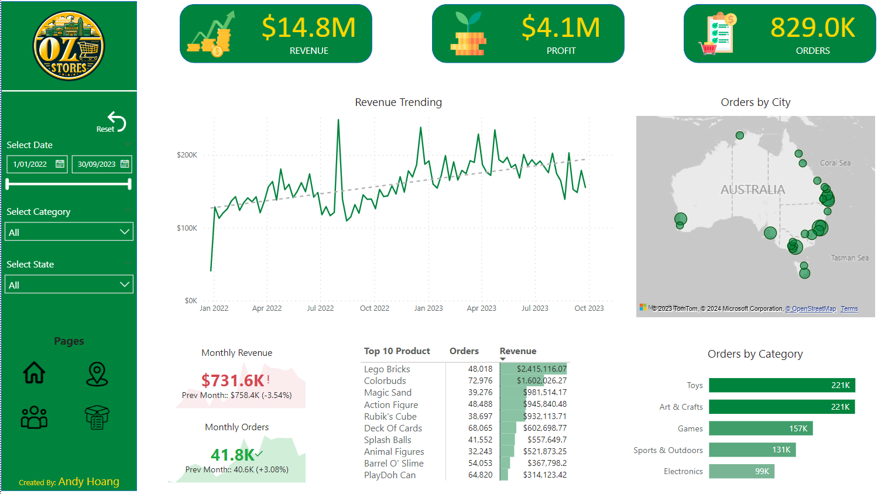
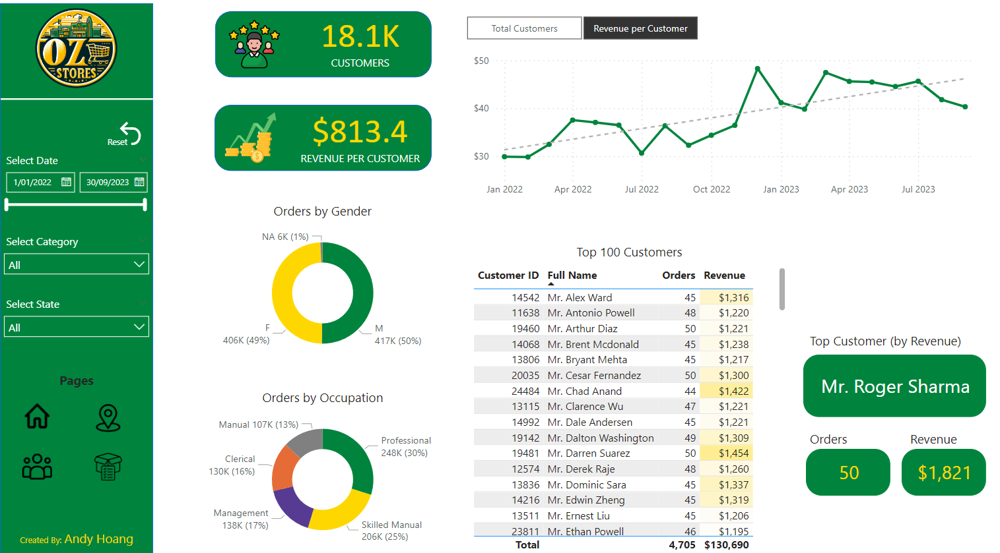

# PowerBI-Analytics-OzStores
This PowerBI project analyzes the performance of a fictional store chain with multiple stores across Australia. The goal is to illustrate PowerBI's capabilities in analyzing and reporting on sales data, customer behavior, and key performance indicators.


## Data Collection

The project incorporates data from 7 tables, featuring sales data comprising over 800,000 rows of transactions. The dataset covers various dimensions such as time, products, customers, and store locations. This dataset constructed, drawing inspiration from [Kaggle's Maven Toys Sales](https://www.kaggle.com/datasets/mysarahmadbhat/toy-sales?select=sales.csv) and [Microsoft's AdventureWorks sample database](https://learn.microsoft.com/en-us/sql/samples/adventureworks-install-configure?view=sql-server-ver16&tabs=ssms).

The file "0.Data_Dictionary" in the "data-source" folder provides definitions for the dataset.

## Data Model

The data model is structured as a star schema, which facilitates efficient analysis and reporting. The central fact table contains sales data, and it is connected to dimension tables such as time, products, customers, and stores.


## Report Pages

The PowerBI report provides 4 main pages:

1. **Executive dashboard:** Depicting sales trends over time, and key information for executives.



2. **Map:** Comparison of sales performance among different stores based on locations.


3. **Customer:** Identification of customer segments based on purchasing behavior.



4. **Product Detail:** In-depth exploration of the selected product.


## Features of the Report

### Parameters

The report uses parameters to allow users to dynamically interact with visuals.


### Navigation Buttons

The report includes navigation buttons between pages, enhancing user experience and facilitating seamless exploration of different aspects of the data.


### Drill Up and Drill Down

Users can drill up or down to explore data at different levels of granularity. For example, drilling down from yearly sales to monthly or weekly sales.

### KPIs Compared to Previous Month

Key Performance Indicators (KPIs) are displayed with a comparison to the previous month. This allows users to quickly assess performance trends and variations.

## Getting Started

To explore the PowerBI report, follow these steps:

1. Clone the repository to your local machine.
   ```bash
   git clone https://github.com/Andy-Hoang/PowerBI-Analytics-OzStores.git
   ```

2. Adjust data source path.
   - Open the PowerBI project file using PowerBI Desktop.
   - Open Power Query Editor and locate the query containing the data source path. It might look like the following:
    ```m
     = Csv.Document(File.Contents("<your local csv file path>"),[Delimiter=",", Columns=6, Encoding=65001, QuoteStyle=QuoteStyle.None])
     ```
   - Replace `<your local csv file path>` with the actual path to your local CSV file.

Feel free to reach out if you encounter any issues or have further questions!
